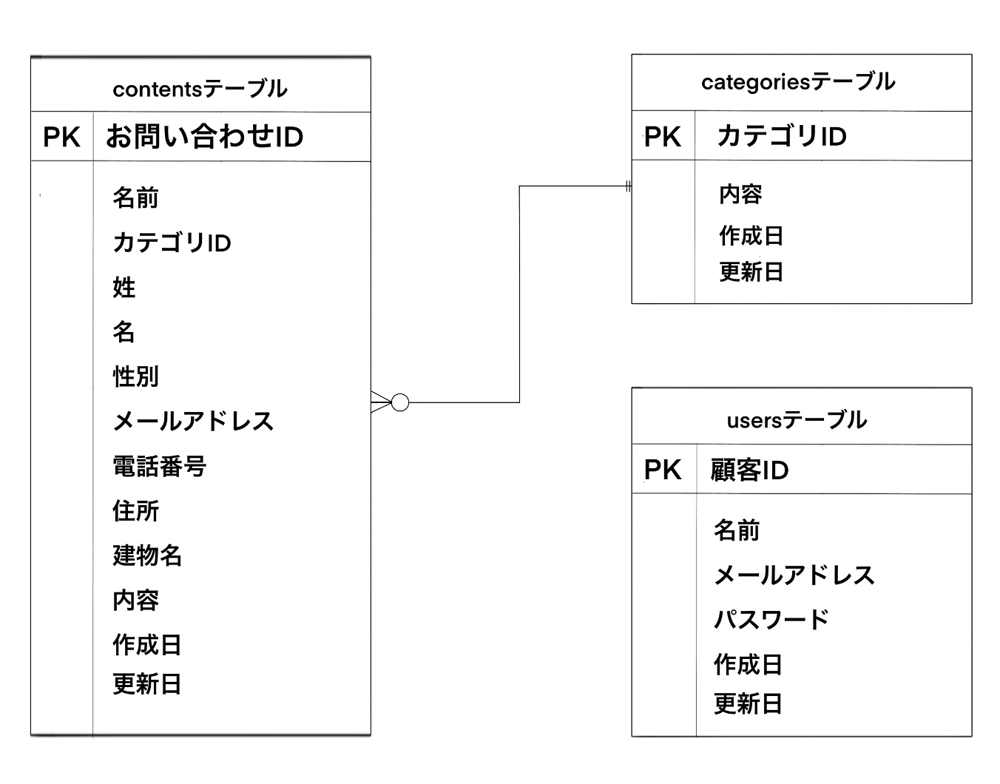

# お問い合わせフォーム

## 環境構築

- Docker ビルド
  1.git clone git@github.com:POYO0328/fashionablyLate.git
  2.docker-compose up -d -buld

\*MySQL は、OS によって起動しない場合があるのでそれぞれの PC に合わせて docker-compose.yml ファイルを編集してください。

Laravel 環境構築

1. docker-composer exec php bash
2. composer install
3. envexample ファイルから.env を作成し、環境変数を変更
4. php artisan key:generate
5. php artisan migrate
6. php artisan db:seed

## 使用技術

・PHP 8.4.3
・Laravel 8.83.8
・MySQL 8.0

## ER 図

## URL

・開発環境：http://localhost/
・phpMyAdmin：http://localhost:8080/
